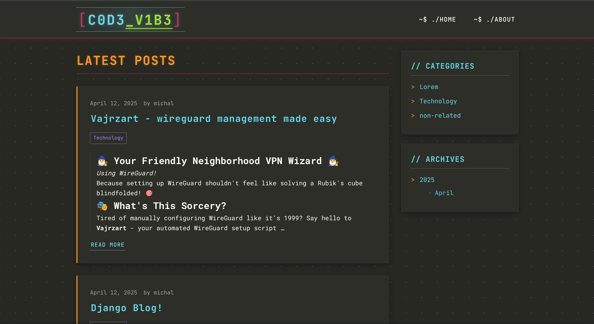

# C0D3_V1B3 - Simple Django Blog

A sleek, programmer-themed blog platform built with Django and simple web technologies. This project features a clean, responsive design with syntax highlighting, Markdown support, and interactive UI elements - all implemented without JavaScript frameworks.

**FYI: This is a sample personal project I created in order to actually learn Django.**



## ✨ Features

### Content Management

- **Rich Markdown Editor**: Full-featured editor with live preview using django-mdeditor
- **Syntax Highlighting**: Code blocks with Monokai theme and language detection
- **Category System**: Organize posts by custom categories
- **Comment System**: User comments with admin moderation

### User Experience

- **Responsive Design**: Mobile-first layout that works on all devices
- **Code Copy Buttons**: One-click code copying for all code blocks
- **Code Scanner Effect**: Aesthetic code-themed visual effects
- **Archive Navigation**: Browse posts by month and year
- **Pagination**: For post listings with customized styling

### Admin Features

- **Custom Admin Interface**: Enhanced Django admin for blog management
- **Markdown Preview**: See rendered content while editing
- **Comment Moderation**: Approve or delete comments from admin interface
- **Drafts System**: Save posts as drafts before publishing

## 🏗️ Architecture

C0D3_V1B3 follows a clean architecture pattern with Django's MVT approach:

- **Models**: Defined in `blog/models.py` with clear relationships
- **Views**: Class-based views with a custom mixin for shared functionality
- **Templates**: Organized in `templates/` directory with inheritance
- **Static Files**: CSS and JavaScript in `static/` directory

### Design Patterns

- **Mixin Pattern**: `BlogContextMixin` provides common context data to all views
- **Class-Based Views**: Leveraging Django's generic views for common operations
- **Template Inheritance**: Base template with blocks for specialized content
- **Responsive Design**: Mobile-first CSS with media queries

## 🛠️ Technology Stack

- **Backend**:
  - Python 3.x
  - Django 5.2
  - SQLite (easily switchable to PostgreSQL for production)

- **Frontend**:
  - HTML5 & CSS3
  - Vanilla JavaScript (ES6+)
  - No frameworks or dependencies

- **Markdown Processing**:
  - django-mdeditor for editing
  - django-markdownify for rendering

## 📦 Installation and Setup

1. **Clone the repository**
```bash
git clone https://github.com/MichalPolach/C0D3_V1B3.git
cd C0D3_V1B3
```

2. **Create a virtual environment and activate it**
```bash
python -m venv venv
source venv/bin/activate  # On Windows: venv\Scripts\activate
```

3. **Install dependencies**
```bash
pip install -r requirements.txt
```

4. **Run migrations**
```bash
python manage.py migrate
```

5. **Create a superuser to manage the blog**
```bash
python manage.py createsuperuser
```

6. **Run the development server**
```bash
python manage.py runserver
```

7. **Visit `http://127.0.0.1:8000/` in your browser**

## 🧩 Usage

### Admin Interface

Access the admin interface at `http://127.0.0.1:8000/admin/` with your superuser credentials.

### Creating Blog Posts

1. Log in to the admin interface
2. Go to "Posts" and click "Add Post"
3. Fill in the details:
   - Title: The post title
   - Slug: URL-friendly version of the title (auto-generated)
   - Author: Select the author
   - Content: Write in Markdown format using the rich editor
   - Categories: Select or create categories
   - Status: Draft (0) or Published (1)
4. Click "Save"

### Managing Comments

Comments submitted by users will be held for moderation. Approve them in the admin interface.

## 🔧 Customization

### Templates

All templates are located in the `templates` directory:

- `templates/base.html` - Main layout
- `templates/blog/home.html` - Homepage
- `templates/blog/post_detail.html` - Single post view
- `templates/blog/category.html` - Category archive
- `templates/blog/archive.html` - Date-based archive
- `templates/blog/about.html` - About the author

### Static Files

- CSS: `static/css/style.css`
- JavaScript: `static/js/main.js`

### Color Scheme

The site uses a Monokai-inspired color palette defined as CSS variables in `static/css/style.css`.

## 🧑‍💻 Developer Notes

### Code Organization

- **views.py**: Contains view classes and the shared context mixin
- **models.py**: Defines the database structure
- **admin.py**: Customizes the admin interface
- **urls.py**: URL routing configuration

### Design Decisions

- Used Django's class-based views for maintainability and DRY code
- Implemented a custom mixin to share common context data across views
- Used vanilla JavaScript instead of frameworks for better performance and fewer dependencies
- Implemented responsive design with a mobile-first approach
- Chose Markdown for content to keep the focus on writing and code presentation

### Future Improvements

- User authentication for comments (currently anonymous)
- Social sharing functionality
- Search functionality
- Related posts feature
- Tag system in addition to categories
- RSS feed for subscriptions

## 📄 License

This project is open source and available under the [MIT License](LICENSE). 